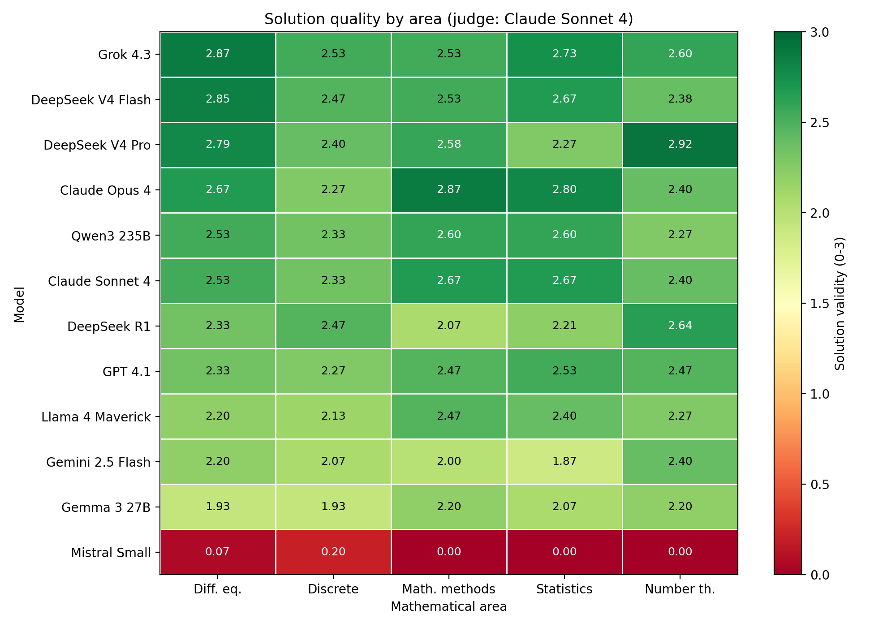

# LLM University-Level Mathematics Benchmark

**English** · [Русский](README.ru.md)

Open dataset for the paper **"Comparative evaluation of large language models as assistants for solving university-level mathematics problems: a process-level rubric analysis"** (Kubrak V.A., Spivak D.R., Nozdryakov D.V., Zakrevskaya E.A., Sviridova O.A., 2026).

Unlike answer-only math benchmarks, this dataset evaluates the **solution process**, not just the final answer, using a multidimensional rubric graded by an LLM-as-a-judge. The source problems are university-level, in Russian, drawn from standard problem books.

## Where is what

| Path | What is there |
|------|---------------|
| [`data/problems/`](data/problems/) | The **75 source problems** (YAML, 5 areas × 15): statement, **reference answer**, difficulty, topic, source. |
| [`data/responses/`](data/responses/) | **Raw model outputs** — 12 JSON files, one per model: full solution text, latency, token counts, model snapshot id. |
| [`data/scores/`](data/scores/) | **Per-response judge scores** — 12 JSON files: answer correctness, solution validity, error type, comment. |
| [`solutions/by-task/`](solutions/by-task/) | Human-readable: for each task, **every model's full solution labelled by model**, with its judge score. One file per area. |
| [`solutions/best-solution-per-task.md`](solutions/best-solution-per-task.md) | One correct, highest-validity solution per task — an answer-key supplement. |
| [`results/tables/`](results/tables/) | Aggregate **CSV tables**: overall, by area, by difficulty, error distribution, all scores. |
| [`results/figures/`](results/figures/) | The paper's **figures**, colour, in [English](results/figures/en/) and [Russian](results/figures/ru/). |
| [`prompts/`](prompts/) | The exact **solver prompt** and the **LLM-as-a-judge rubric prompt**. |
| [`validation/`](validation/) | **Judge reliability**: human-expert and second-LLM grades, blind worksheets, grading instructions — see [validation/README](validation/README.md). |
| [`code/evaluate.py`](code/evaluate.py) | The **LLM-as-a-judge** scoring script. |

## Repository structure

```
.
├── data/
│   ├── problems/      75 tasks (YAML): statement, reference answer, difficulty, topic, source
│   ├── responses/     raw model responses (12 JSON, one per model)
│   └── scores/        per-response judge scores (12 JSON)
├── results/
│   ├── tables/        aggregate CSVs
│   └── figures/       figures (en/ and ru/), colour
├── solutions/         by-task/ (all 12 models per task) + best-solution-per-task.md
├── prompts/           solver prompt + judge rubric prompt
├── validation/        judge reliability (human + second LLM)
└── code/              evaluate.py (the LLM-as-a-judge scoring script)
```

## Method (as run)

- **12 models** via OpenRouter, 27–28 May 2026: Grok 4.3, Claude Opus 4, Claude Sonnet 4, GPT-4.1, Gemini 2.5 Flash, DeepSeek V4 Pro, DeepSeek V4 Flash, DeepSeek R1, Qwen3 235B, Llama 4 Maverick, Gemma 3 27B, Mistral Small.
- **75 problems**, single text track, **one run per problem** (N=1), `temperature=0`, `max_tokens=4096`.
- **Judge:** `anthropic/claude-sonnet-4` against a reference answer. 887/900 responses scored.
- **Rubric:** answer correctness (0/1), solution validity (0–3), error type (PE/CE/AE/HE/IE/NONE), completeness (0–2), clarity (0–2).
- **Judge reliability** ([`validation/`](validation/README.md)): an independent **human expert** re-graded 30 responses (quadratic-weighted Cohen's κ = 0.74 on validity vs the judge), corroborated by a second LLM (Claude Opus 4.8) that agreed with the human at κ = 0.97.

### Headline results (mean solution validity, 0–3)

| Model | Accuracy (0–1) | Validity (0–3) | Avg. time (s) | n |
|-------|----------------|----------------|---------------|---|
| Grok 4.3 | 0.827 | **2.65** | 10.7 | 75 |
| Claude Opus 4 | 0.787 | 2.60 | 41.7 | 75 |
| DeepSeek V4 Flash | 0.803 | 2.58 | 32.2 | 71 |
| DeepSeek V4 Pro | 0.765 | 2.57 | 41.1 | 68 |
| Claude Sonnet 4 | 0.773 | 2.52 | 12.1 | 75 |
| Qwen3 235B | 0.800 | 2.47 | 61.4 | 75 |
| GPT-4.1 | 0.760 | 2.41 | 11.2 | 75 |
| DeepSeek R1 | 0.699 | 2.34 | 146.2 | 73 |
| Llama 4 Maverick | 0.693 | 2.29 | 22.6 | 75 |
| Gemini 2.5 Flash | 0.587 | 2.11 | 11.8 | 75 |
| Gemma 3 27B | 0.573 | 2.07 | 30.7 | 75 |
| Mistral Small | 0.013 | 0.05 | 1.8 | 75 |

Differences across models are significant (Friedman test, χ²=351, p<0.001).



### Errata

Judge validation surfaced two reference-key errors, now corrected in `data/problems/`: **DM-12** (a₁₀ = 10240, not 5120) and **MS-13** (variance D(α\*) = α²/(n−2)). Task **NT-14** reference answer added (d = 111, derived in the paper supplement).

## License

Dataset: **CC BY 4.0**. Code: **MIT**. See [`LICENSE`](LICENSE).

## Citation

```bibtex
@article{kubrak2026llmmath,
  title   = {Comparative evaluation of large language models as assistants for solving
             university-level mathematics problems: a process-level rubric analysis},
  author  = {Kubrak, V.A. and Spivak, D.R. and Nozdryakov, D.V. and
             Zakrevskaya, E.A. and Sviridova, O.A.},
  year    = {2026}
}
```
