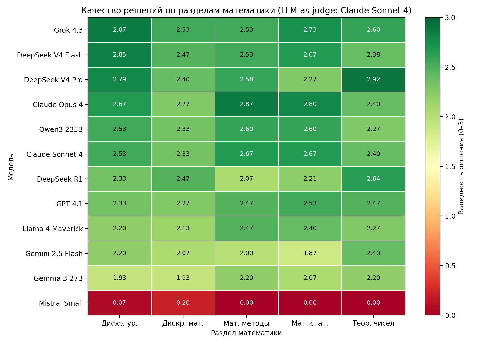

# Бенчмарк LLM на математике университетского уровня

[English](README.md) · **Русский**

Открытый датасет к статье **«Сравнительная оценка больших языковых моделей как помощников при решении математических задач университетского уровня: анализ процесса решения по многомерной рубрике»** (Кубрак В.А., Спивак Д.Р., Ноздряков Д.В., Закревская Е.А., Свиридова О.А., 2026).

В отличие от бенчмарков, проверяющих только итоговый ответ, здесь оценивается **процесс решения**, а не только финальный ответ — по многомерной рубрике, выставляемой моделью-судьёй (LLM-as-a-judge). Исходные задачи — университетского уровня, на русском языке, из стандартных задачников.

## Где что лежит

| Путь | Что внутри |
|------|------------|
| [`data/problems/`](data/problems/) | **75 исходных задач** (YAML, 5 разделов × 15): условие, **эталонный ответ**, сложность, тема, источник. |
| [`data/responses/`](data/responses/) | **Сырые ответы моделей** — 12 JSON, по одному на модель: полный текст решения, задержка, число токенов, snapshot-id модели. |
| [`data/scores/`](data/scores/) | **Оценки судьи по каждому ответу** — 12 JSON: правильность ответа, валидность решения, тип ошибки, комментарий. |
| [`solutions/by-task/`](solutions/by-task/) | Человекочитаемо: для каждой задачи — **полные решения всех моделей с подписью, какая модель решала**, и оценкой судьи. По файлу на раздел. |
| [`solutions/best-solution-per-task.md`](solutions/best-solution-per-task.md) | По одному верному решению с наивысшей валидностью на каждую задачу — как дополнение к ключу ответов. |
| [`results/tables/`](results/tables/) | Сводные **CSV-таблицы**: общая, по разделам, по сложности, распределение ошибок, все оценки. |
| [`results/figures/`](results/figures/) | **Рисунки** статьи, цветные, на [английском](results/figures/en/) и [русском](results/figures/ru/). |
| [`prompts/`](prompts/) | Точные **промпт для решателя** и **промпт-рубрика для судьи**. |
| [`validation/`](validation/) | **Надёжность судьи**: оценки человека-эксперта и второй модели, слепые бланки, инструкция — см. [validation/README](validation/README.md). |
| [`code/evaluate.py`](code/evaluate.py) | Скрипт оценивания **LLM-as-a-judge**. |

## Структура репозитория

```
.
├── data/
│   ├── problems/      75 задач (YAML): условие, эталонный ответ, сложность, тема, источник
│   ├── responses/     сырые ответы моделей (12 JSON, по одному на модель)
│   └── scores/        оценки судьи по каждому ответу (12 JSON)
├── results/
│   ├── tables/        сводные CSV
│   └── figures/       рисунки (en/ и ru/), цветные
├── solutions/         by-task/ (все 12 моделей по каждой задаче) + best-solution-per-task.md
├── prompts/           промпт решателя + промпт-рубрика судьи
├── validation/        надёжность судьи (человек + вторая модель)
└── code/              evaluate.py (скрипт оценивания LLM-as-a-judge)
```

## Методика (как проводилось)

- **12 моделей** через OpenRouter, 27–28 мая 2026: Grok 4.3, Claude Opus 4, Claude Sonnet 4, GPT-4.1, Gemini 2.5 Flash, DeepSeek V4 Pro, DeepSeek V4 Flash, DeepSeek R1, Qwen3 235B, Llama 4 Maverick, Gemma 3 27B, Mistral Small.
- **75 задач**, единый текстовый трек, **один прогон на задачу** (N=1), `temperature=0`, `max_tokens=4096`.
- **Судья:** `anthropic/claude-sonnet-4` сравнивает с эталонным ответом. Оценено 887/900 ответов.
- **Рубрика:** правильность ответа (0/1), валидность решения (0–3), тип ошибки (PE/CE/AE/HE/IE/NONE), полнота (0–2), ясность (0–2).
- **Надёжность судьи** ([`validation/`](validation/README.md)): независимый **человек-эксперт** переоценил 30 ответов (взвешенная κ Коэна = 0.74 по валидности относительно судьи), что подтверждено второй моделью (Claude Opus 4.8), совпавшей с человеком на κ = 0.97.

### Ключевые результаты (средняя валидность решения, 0–3)

| Модель | Точность (0–1) | Валидность (0–3) | Ср. время (с) | n |
|--------|----------------|------------------|---------------|---|
| Grok 4.3 | 0,827 | **2,65** | 10,7 | 75 |
| Claude Opus 4 | 0,787 | 2,60 | 41,7 | 75 |
| DeepSeek V4 Flash | 0,803 | 2,58 | 32,2 | 71 |
| DeepSeek V4 Pro | 0,765 | 2,57 | 41,1 | 68 |
| Claude Sonnet 4 | 0,773 | 2,52 | 12,1 | 75 |
| Qwen3 235B | 0,800 | 2,47 | 61,4 | 75 |
| GPT-4.1 | 0,760 | 2,41 | 11,2 | 75 |
| DeepSeek R1 | 0,699 | 2,34 | 146,2 | 73 |
| Llama 4 Maverick | 0,693 | 2,29 | 22,6 | 75 |
| Gemini 2.5 Flash | 0,587 | 2,11 | 11,8 | 75 |
| Gemma 3 27B | 0,573 | 2,07 | 30,7 | 75 |
| Mistral Small | 0,013 | 0,05 | 1,8 | 75 |

Различия между моделями статистически значимы (критерий Фридмана, χ²=351, p<0,001).



### Исправления (errata)

Валидация судьи вскрыла две ошибки в эталонах, исправленные в `data/problems/`: **DM-12** (a₁₀ = 10240, а не 5120) и **MS-13** (дисперсия D(α\*) = α²/(n−2)). Для задачи **NT-14** добавлен эталонный ответ (d = 111, вывод — в приложении к статье).

## Лицензия

Датасет: **CC BY 4.0**. Код: **MIT**. См. [`LICENSE`](LICENSE).

## Цитирование

```bibtex
@article{kubrak2026llmmath,
  title   = {Comparative evaluation of large language models as assistants for solving
             university-level mathematics problems: a process-level rubric analysis},
  author  = {Kubrak, V.A. and Spivak, D.R. and Nozdryakov, D.V. and
             Zakrevskaya, E.A. and Sviridova, O.A.},
  year    = {2026}
}
```
